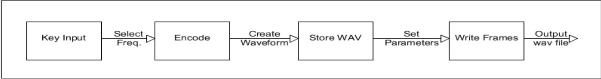
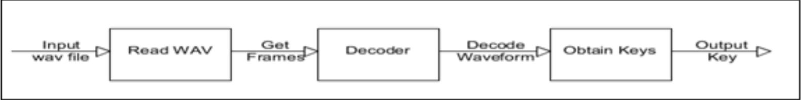
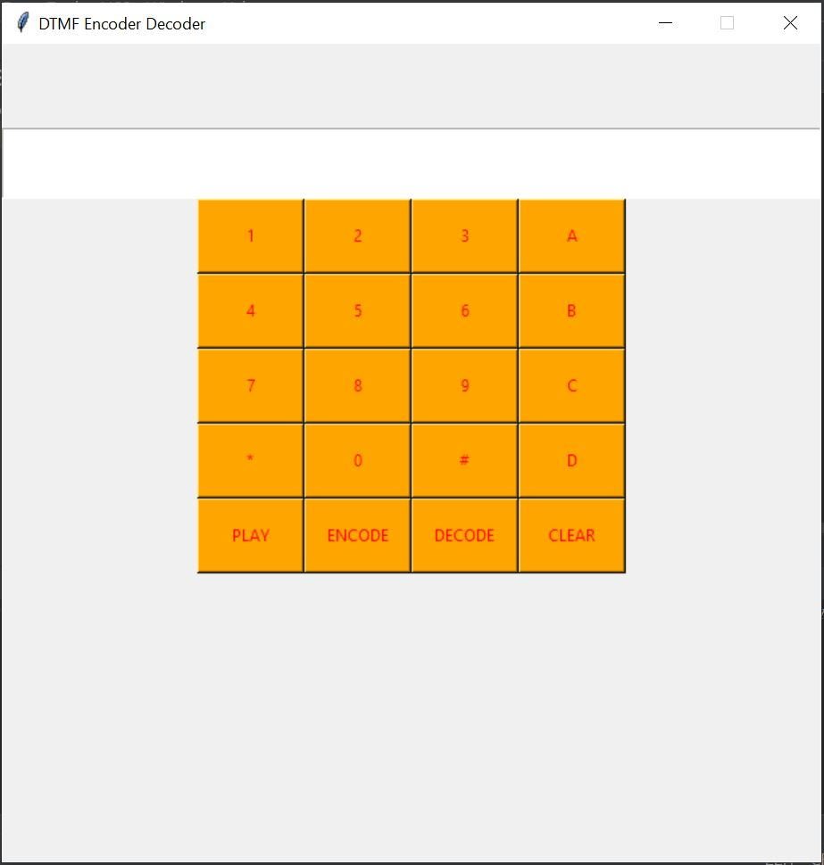

**Aim:** 	To make a python based DTMF(Dual tone Multi frequency) tones encoder and decoder utilising the functions of Python GUI.

## Project Description:	
The following are the frequencies used for the DTMF (dual-tone, multi-frequency) system, which is also referred to as tone dialling. The signal is encoded as a pair of sinusoidal (sine wave) tones from the table below which are mixed with each other. DTMF is used by most PSTN (public switched telephone networks) systems for number dialling, and is also used for voice-response systems such as telephone banking and sometimes over private radio networks to provide signalling and transferring of small amounts of data

Our projects involves 3 parts:
### Encoder: 
Given the input string of numbers/alphabet(keys) from the user, the python script would create a dual frequency (Acc. to the above table) tone for 500 ms with a 100ms silence tone and create a wav audio file.The code even handles mistyped letters by ignoring them and giving a silence tone in place of it. It creates a mono channel audio with a sample rate of 8000. Each tone has 2 frequencies, a high and low frequency encoded in itself.

**Algorithm:**

### Decoder:
The audio file is read by the python script, and converted to a string of bytes. These bytes are divided in frames and each frame has tone with 2 frequency. The high and low frequency are detected for the respective tone by Goertzel Algorithm which is an efficient evaluation in terms of Discrete Fourier Transform (DFT).This algorithm has higher complexity than FFT but numerically efficient for such small number of frequency components.Based on the low and high frequency of each tone identified, the decoder identifies the appropriate key. The decoder returns the string of numbers/alphabets(keys) identified solely from the audio file.

**Algorithm:**

### GUI (Graphical user interface): 
The python GUI was made for better user experience. The GUI has a numpad similar to a phone keypad. 4 more buttons namely Play, Encode, Decode and Clear are present and do the respective function as their name mentions.
   

### Output: [Video](https://youtu.be/2RcQnEqW8ys)

### Applications of DTMF Encoder Decoder:
- Dial telephone numbers
- Issue commands to switching circuits
- Mobile communication systems
- Automatic voice recorded instructions

### Conclusion: 
We learnt the concept of Dual Tone Multi Frequency Dial Tones, their encoding technique and decoding  technique. We also learnt the implementation of Goertzel Algorithm for decoding purposes. Finally we learnt and implemented Object oriented concepts of python and their modules like scipy, wave and tkinter(For GUI). We also got the experience of working together remotely and the extensive use of Github.  
